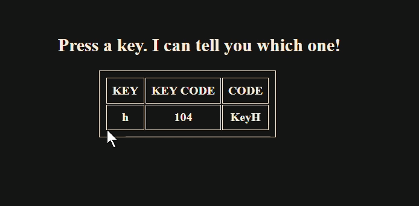

# Keyboard Key Detector

## 📌 Description

Keyboard Key Detector is a simple interactive web application built using HTML, CSS, and JavaScript. The webpage dynamically detects keyboard input and displays information about the pressed key in a table format.

For every key press, the application instantly updates and shows:

* The key pressed
* Its ASCII value (or key code)
* Its keyboard event code

This project demonstrates real-time event handling and dynamic DOM updates using JavaScript.

## ✨ Features

* Detects keyboard input in real time
* Dynamically updates data on every key press
* Clean and responsive table-based UI

## 🛠️ Technologies Used

* HTML5
* CSS3
* JavaScript

## ⚙️ How to Run

1. Clone the repository:

   ```bash
   git clone https://github.com/Aashu-Goswami/Keyboard.git
   ```

2. Launch `index.html` in your preferred web browser.

## 🧠 Concepts Practiced

* DOM Manipulation
* Event Listeners
* Keyboard Events
* Dynamic HTML Rendering

## 🎥 Preview


## 🚀 Future Improvements

* Track key press history
* Add special key detection (Ctrl, Shift, Alt)
* Improve UI animations
* Show key press frequency statistics

## 🎯 Learning Purpose

This project was created to strengthen understanding of JavaScript event handling and dynamic user interaction in web applications.

## 👤 Author

Aashu Goswami
